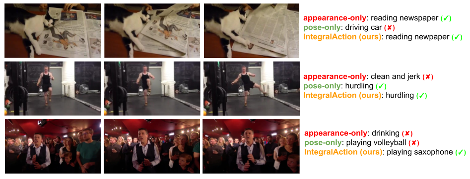

# IntegralAction: Pose-driven Feature Integration for Robust Human Action Recognition in Videos
  
<p align="center">  
  
</p> 


## Introduction  
This repo is official **[PyTorch](https://pytorch.org)** implementation of **[IntegralAction: Pose-driven Feature Integration for Robust Human Action Recognition in Videos (CVPRW 2021. Oral.)](https://arxiv.org/abs/2007.06317)**. 
  
  
## Directory  
### Root  
The `${ROOT}` is described as below.  
```  
${ROOT}  
|-- data  
|-- common  
|-- main  
|-- tool
|-- output  
```  
* `data` contains data loading codes and soft links to images and annotations directories.  
* `common` contains kernel codes for IntegralAction.  
* `main` contains high-level codes for training or testing the network.  
* `tool` contains a code to merge models of `rgb_only` and `pose_only` stages.
* `output` contains log, trained models, visualized outputs, and test result.  
  
### Data  
You need to follow directory structure of the `data` as below.  
```  
${ROOT}  
|-- data  
|   |-- Kinetics
|   |   |-- data
|   |   |   |-- frames 
|   |   |   |-- kinetics-skeleton
|   |   |   |-- Kinetics50_train.json
|   |   |   |-- Kinetics50_val.json
|   |   |   |-- Kinetics400_train.json
|   |   |   |-- Kinetics400_val.json
|   |-- Mimetics
|   |   |-- data  
|   |   |   |-- frames 
|   |   |   |-- pose_results 
|   |   |   |-- Mimetics50.json
|   |   |   |-- Mimetics400.json
|   |-- NTU
|   |   |-- data  
|   |   |   |-- frames 
|   |   |   |-- nturgb+d_skeletons
|   |   |   |-- NTU_train.json
|   |   |   |-- NTU_test.json
```  
* Download Kinetics parsed data [[data](https://1drv.ms/f/s!All7gdNh7XE5lhOXzodom10c4Qp5?e=iPy5x7)] [[website](https://deepmind.com/research/open-source/kinetics)]
* Download Mimetics parsed data [[data](https://1drv.ms/f/s!All7gdNh7XE5lhco_7mdux62Wzto?e=DU1djz)] [[website](https://europe.naverlabs.com/research/computer-vision/mimetics/)]
* Download NTU parsed data [[data](https://1drv.ms/f/s!All7gdNh7XE5lh7Nhw9eZyhgrQ-3?e=lK4WGB)] [[website](http://rose1.ntu.edu.sg/datasets/actionrecognition.asp)]
* All annotation files follow [MS COCO format](http://cocodataset.org/#format-data).  
* If you want to add your own dataset, you have to convert it to [MS COCO format](http://cocodataset.org/#format-data).  
  
### Output  
You need to follow the directory structure of the `output` folder as below.  
```  
${ROOT}  
|-- output  
|   |-- log  
|   |-- model_dump  
|   |-- result  
|   |-- vis  
```  
* Creating `output` folder as soft link form is recommended instead of folder form because it would take large storage capacity.  
* `log` folder contains training log file.  
* `model_dump` folder contains saved checkpoints for each epoch.  
* `result` folder contains final estimation files generated in the testing stage.  
* `vis` folder contains visualized results.  


## Running IntegralAction
### Start  
* Install **[PyTorch](https://pytorch.org)** and Python >= 3.7.3 and run `sh requirements.sh`. 
* In the `main/config.py`, you can change settings of the model including dataset to use, network backbone, and input size and so on.  
* There are three stages. 1) `rgb_only` , 2) `pose_only`, and 3) `rgb+pose`. In the `rgb_only` stage, only RGB stream is trained, and in the `pose_only` stage, only pose stream is trained. Finally, `rgb+pose` stage initializes weights from the previous two stages and continue training by the pose-drive integration.
  
### Train  
#### 1. `rgb_only` stage
In the `main` folder, run  
```bash  
python train.py --gpu 0-3 --mode rgb_only
```  
to train IntegralAction in the `rgb_only` stage on the GPU 0,1,2,3. `--gpu 0,1,2,3` can be used instead of `--gpu 0-3`. 
Then, backup the trained weights by running
```bash  
mkdir ../output/model_dump/rgb_only
mv ../output/model_dump/snapshot_*.pth.tar ../output/model_dump/rgb_only/.
```  

#### 2. `pose_only` stage
In the `main` folder, run  
```bash  
python train.py --gpu 0-3 --mode pose_only
```  
to train IntegralAction in the `pose_only` stage on the GPU 0,1,2,3. `--gpu 0,1,2,3` can be used instead of `--gpu 0-3`.  
Then, backup the trained weights by running
```bash  
mkdir ../output/model_dump/pose_only
mv ../output/model_dump/snapshot_*.pth.tar ../output/model_dump/pose_only/.
```  

#### 3. `rgb+pose` stage
In the `tool` folder, run
```bash  
cp ../output/model_dump/rgb_only/snapshot_29.pth.tar snapshot_29_rgb_only.pth.tar
cp ../output/model_dump/pose_only/snapshot_29.pth.tar snapshot_29_pose_only.pth.tar
python merge_rgb_only_pose_only.py
mv snapshot_0.pth.tar ../output/model_dump/.
```  

In the `main` folder, run  
```bash  
python train.py --gpu 0-3 --mode rgb+pose --continue
```  
to train IntegralAction in the `rgb+pose` stage on the GPU 0,1,2,3. `--gpu 0,1,2,3` can be used instead of `--gpu 0-3`.  

### Test  
Place trained model at the `output/model_dump/`.  Choose the stage you want to test from one of [`rgb_only`, `pose_only`, `rgb+pose`].
  
In the `main` folder, run  
```bash  
python test.py --gpu 0-3 --mode $STAGE --test_epoch 29
```  
to test IntegralAction in `$STAGE` stage (should be one of [`rgb_only`, `pose_only`, `rgb+pose`]) on the GPU 0,1,2,3 with 29th epoch trained model. `--gpu 0,1,2,3` can be used instead of `--gpu 0-3`.  
  
## Results  
Here I report the performance of the IntegralAction.  
<p align="center">

</p>

#### Kinetics50 
* Download IntegralAction trained on [[Kinetics50](https://1drv.ms/u/s!All7gdNh7XE5oGowZaY0Y-uKOHr8?e=Vj0xNm)].
* Kinetics50 is a subset of Kinetics400. It mainly contains videos with human motion-related action classes, sampled from Kinetics400.
```
(base) mks0601:~/workspace/IntegralAction/main$ python test.py --gpu 5-6 --mode rgb+pose --test_epoch 29
>>> Using GPU: 5,6
04-15 11:48:25 Creating dataset...
loading annotations into memory...
Done (t=0.01s)
creating index...
index created!
04-15 11:48:25 Load checkpoint from ../output/model_dump/snapshot_29.pth.tar
04-15 11:48:25 Creating graph...
100%|█████████████████████████████████████████████████████████████████████████████████████████████████████████████████████████████████████████████████████████████████████████████████████████| 773/773 [03:09<00:00,  5.11it/s]
Evaluation start...
Top-1 accuracy: 72.2087
Top-5 accuracy: 92.2735
Result is saved at: ../output/result/kinetics_result.json
```
#### Mimetics
* Download IntegralAction trained on [[Kinetics50](https://1drv.ms/u/s!All7gdNh7XE5oGowZaY0Y-uKOHr8?e=Vj0xNm)].
* Kinetics50 is a subset of Kinetics400. It mainly contains videos with human motion-related action classes, sampled from Kinetics400.
* Note that Mimetics is used only for the testing purpose.
```
(base) mks0601:~/workspace/IntegralAction/main$ python test.py --gpu 5-6 --mode rgb+pose --test_epoch 29
>>> Using GPU: 5,6
04-15 11:52:20 Creating dataset...
loading annotations into memory...
Done (t=0.01s)
creating index...
index created!
04-15 11:52:20 Load checkpoint from ../output/model_dump/snapshot_29.pth.tar
04-15 11:52:20 Creating graph...
100%|█████████████████████████████████████████████████████████████████████████████████████████████████████████████████████████████████████████████████████████████████████████████████████████| 187/187 [02:14<00:00,  4.93it/s]
Evaluation start...
Top-1 accuracy: 26.5101
Top-5 accuracy: 50.5034
Result is saved at: ../output/result/mimetics_result.json
```
 


## Reference  
```  
@InProceedings{moon2021integralaction,
  title={IntegralAction: Pose-driven Feature Integration for Robust Human Action Recognition in Videos},
  author={Moon, Gyeongsik and Kwon, Heeseung and Lee, Kyoung Mu and Cho, Minsu},
  booktitle = {The IEEE Conference on Computer Vision and Pattern Recognition Workshop (CVPRW)}, 
  year={2021}
}
```


